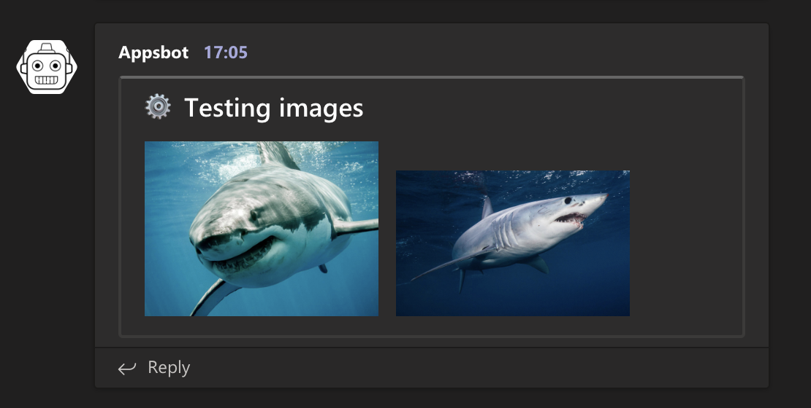

# @reuters-graphics/teams-klaxon

[](https://badge.fury.io/js/%40reuters-graphics%2Fteams-klaxon) [](https://github.com/reuters-graphics/)

Send messages to a Microsoft Teams channel.

## Quickstart

Setup a Microsoft Teams [incoming webhook](https://docs.microsoft.com/en-us/microsoftteams/platform/webhooks-and-connectors/how-to/add-incoming-webhook) in a channel, then install the library.

```
$ yarn add @reuters-graphics/teams-klaxon
```

```javascript
const TeamsKlaxon = require('@reuters-graphics/teams-klaxon');

// Your incoming webhook
const webhook = 'https://outlook.office.com/webhook/...';

const klaxon = new TeamsKlaxon(webhook);

await klaxon.log({
  text: 'A simple message',
});
```
## Message formats

#### Text

```javascript
await klaxon.log({
  text: 'A simple message',
});
```


#### Facts

```javascript
await klaxon.log({
  title: '⚙️ Testing facts',
  facts: {
    Name: 'Jon McClure',
    Age: '35',
  },
});
```


#### Images

```javascript
await klaxon.log({
  title: '⚙️ Testing images',
  images: [
    'https://scitechdaily.com/images/Great-White-Shark-Smile-1536x1152.jpg',
    'https://cdn.britannica.com/79/65379-050-5CF52BAC/Shortfin-mako-shark-seas.jpg',
  ],
});
```



#### Stack trace

```javascript
await klaxon.log({
  title: '⚙️ Testing stack trace',
  stackTrace: {
    title: 'Stack trace',
    code: 'console.log(\'hello world\'!)',
  },
});
```


#### Link buttons

```javascript
await klaxon.log({
  title: '⚙️ Testing link buttons',
  linkButtons: [{
    name: 'Google',
    link: 'https://www.google.com',
  }, {
    name: 'Twitter',
    link: 'https://www.twitter.com',
  }],
});
```


#### Color

```javascript
await klaxon.log({
  title: '⚙️ Testing color',
  color: 'FF0000'
});
```


#### Multiple options


```javascript
await klaxon.log({
  title: '⚙️ Testing multiple options',
  color: 'FF0000',
  facts: {
    Name: 'Jon McClure',
    Age: '35',
  },
  images: [
    'https://scitechdaily.com/images/Great-White-Shark-Smile-1536x1152.jpg',
    'https://cdn.britannica.com/79/65379-050-5CF52BAC/Shortfin-mako-shark-seas.jpg',
  ],
  stackTrace: {
    code: 'console.log(\'hello world!\')',
  },
  linkButtons: [{
    name: 'Google',
    link: 'https://www.google.com',
  }, {
    name: 'Twitter',
    link: 'https://www.twitter.com',
  }],
});
```


## Testing

```
$ yarn test
```
